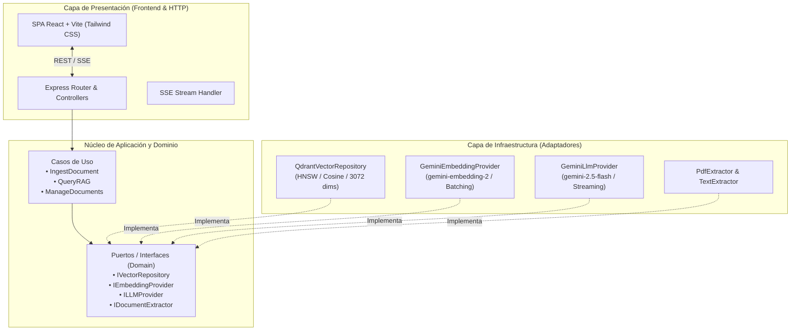

# 🧠 ContextEngine

<p align="center">
  <strong>Motor RAG (Retrieval-Augmented Generation) de grado de producción con Arquitectura Hexagonal, Búsqueda Vectorial HNSW en Qdrant y Streaming en Tiempo Real con Google Gemini.</strong>
</p>

<p align="center">
  
  
  
  
  
  
  
  
  
  
</p>

---

## 📌 Visión General

**ContextEngine** es una plataforma RAG completa diseñada para transformar documentos no estructurados (PDFs, Markdown, texto sin formato) en bases de conocimiento consultables mediante lenguaje natural, mitigando alucinaciones y garantizando respuestas sustentadas con citas y métricas de similitud semántica.

El proyecto fue desarrollado bajo principios de **Clean Code**, **Domain-Driven Design (DDD)** y **Arquitectura Hexagonal (Ports & Adapters)**, permitiendo desacoplar completamente la lógica de negocio de los proveedores de LLM, motores vectoriales o frameworks web.

---

## ✨ Características Principales

- ⚡ **Respuestas con Streaming en Tiempo Real (SSE):** Generación token por token usando Server-Sent Events con baja latencia.
- 📐 **Arquitectura Hexagonal Desacoplada:** Puertos e interfaces que facilitan cambiar de proveedor (ej. Gemini por OpenAI/Claude o Qdrant por Pinecone/Milvus) sin alterar el dominio.
- 🎯 **Inspección de Citas con Similitud Coseno:** Cada respuesta incluye los fragmentos exactos del documento utilizados por el LLM junto con su porcentaje de coincidencia semántica.
- 📑 **Ingesta Multiformato Inteligente:**
  - Carga de archivos **PDF** con extracción de texto estructurada.
  - Carga de archivos **Markdown (.md)** y **Texto Plano (.txt)**.
  - Ingesta directa de texto desde el editor integrado.
  - Chunking semántico con solapamiento (*overlap*) configurable para preservar el contexto entre fragmentos.
- 🗄️ **Indexación Vectorial HNSW de Alto Rendimiento:** Persistencia y búsqueda aproximada de vecinos más cercanos (*k-NN*) en **Qdrant Vector Database** utilizando vectores de 3072 dimensiones.
- 🎨 **Interfaz de Usuario Moderna (App Shell):** Dashboard interactivo desarrollado con Vite + React 19 + Tailwind CSS, con modo oscuro premium, gestor de documentos y previsualización de fuentes.
- 📦 **Monorepo Listo para Despliegue:** Soporte tanto para ejecución en desarrollo (`concurrently` con proxy inverso) como para servir la aplicación compilada como un único servicio Node.js en producción.

---

## 🏗️ Arquitectura del Sistema

El backend sigue estrictamente el patrón de **Puertos y Adaptadores (Arquitectura Hexagonal)**:



### Flujo RAG (Retrieval-Augmented Generation)

1. **Fase de Ingesta:** Documento $\rightarrow$ Extracción de texto plano $\rightarrow$ Estrategia de fragmentación (Chunks con overlap) $\rightarrow$ Generación de Embeddings en batch $\rightarrow$ Upsert con payload de metadatos en Qdrant.
2. **Fase de Recuperación:** Consulta del usuario $\rightarrow$ Embedding de la pregunta $\rightarrow$ Búsqueda por similitud coseno en Qdrant (Top-K) $\rightarrow$ Filtrado por umbral de relevancia (*score threshold*).
3. **Fase de Aumentación y Generación:** Armado de prompt estricto con fragmentos recuperados $\rightarrow$ Inferencia en Gemini 2.5 Flash $\rightarrow$ Streaming continuo de tokens y emisión final de metadatos de fuentes al cliente.

---

## 🛠️ Stack Tecnológico

| Capa | Tecnología | Propósito |
|---|---|---|
| **Lenguaje** | [TypeScript 5.8](https://www.typescriptlang.org/) | Tipado estático de punta a punta tanto en backend como frontend |
| **Backend** | [Node.js v22](https://nodejs.org/) & [Express 5](https://expressjs.com/) | Servidor API RESTful y canal de Server-Sent Events (SSE) |
| **Base de Datos Vectorial** | [Qdrant v1.13](https://qdrant.tech/) | Motor vectorial de alto rendimiento con indexación HNSW ejecutado en Docker |
| **Embeddings & LLM** | [Google Gemini 2.5 Flash](https://ai.google.dev/) | Modelo multimodal de última generación para razonamiento y generación de vectores |
| **Frontend** | [React 19](https://react.dev/) + [Vite 6](https://vitejs.dev/) | SPA moderna, rápida y responsiva con renderizado dinámico |
| **Estilos** | [Tailwind CSS v4](https://tailwindcss.com/) | Diseño de interfaces moderno con glassmorphism y paleta dark mode |
| **Validación & Logs** | [Zod](https://zod.dev/) & [Pino](https://getpino.io/) | Validación de esquemas en runtime y logging estructurado de alto rendimiento |
| **Contenedores** | [Docker & Docker Compose](https://www.docker.com/) | Orquestación aislada de dependencias de infraestructura |

---

## 📂 Estructura del Proyecto

```text
contextEngine/
├── docker-compose.yml             # Servicio de Qdrant Vector DB
├── package.json                   # Scripts del monorepo y dependencias
├── tsconfig.json                  # Configuración de TypeScript
├── .env.example                   # Plantilla de variables de entorno
│
├── src/                           # Backend (Arquitectura Hexagonal)
│   ├── config/                    # Validación de variables de entorno (Zod)
│   ├── domain/                    # Entidades del negocio, DTOs e Interfaces (Puertos)
│   │   ├── entities/              # DocumentChunk, RAGQuery, DocumentMetadata
│   │   └── ports/                 # IVectorRepository, IEmbeddingProvider, ILLMProvider...
│   ├── application/               # Casos de uso de la aplicación
│   │   └── use-cases/             # IngestDocument, QueryRag, ManageDocuments
│   ├── infrastructure/            # Implementación concreta de adaptadores
│   │   ├── ai/                    # GeminiEmbeddingProvider, GeminiLlmProvider
│   │   ├── extractors/            # PdfExtractor, TextExtractor
│   │   ├── logging/               # Logger estructurado Pino
│   │   └── repositories/          # QdrantVectorRepository
│   ├── presentation/              # Controladores, middleware y rutas HTTP
│   │   ├── controllers/           # DocumentController, QueryController, HealthController
│   │   ├── middlewares/           # Multer, Error handler, Validation
│   │   └── routes/                # Enrutador Express
│   ├── app.ts                     # Inyección de dependencias y setup de Express
│   └── server.ts                  # Punto de entrada del servidor backend
│
└── frontend/                      # Frontend (Vite + React + Tailwind CSS)
    ├── src/
    │   ├── components/            # Navbar, DocumentManager, ChatWorkspace, CitationInspector
    │   ├── services/              # Cliente de API y decodificador de streams SSE
    │   ├── types/                 # Interfaces y tipos de la UI
    │   ├── App.tsx                # App shell principal
    │   └── main.tsx               # Bootstrap de React
    └── package.json
```

---

## 🚀 Inicio Rápido

### Prerrequisitos

- **Node.js** (v20 o superior recomendado)
- **Docker** y **Docker Compose**
- **Google Gemini API Key** (obtenible gratis en [Google AI Studio](https://aistudio.google.com/))

### 1. Clonar el repositorio

```bash
git clone https://github.com/tu-usuario/contextEngine.git
cd contextEngine
```

### 2. Instalar dependencias

Instala las dependencias del backend y del frontend:

```bash
npm install
npm run dev:frontend -- --dry-run 2>/dev/null || (cd frontend && npm install)
```

### 3. Configurar variables de entorno

Copia el archivo de ejemplo y añade tu API Key de Google Gemini:

```bash
cp .env.example .env
```

Edita `.env`:

```ini
PORT=3000
GEMINI_API_KEY=tu_api_key_de_gemini_aqui
QDRANT_URL=http://localhost:6333
```

### 4. Iniciar la Base de Datos Vectorial (Qdrant)

Levanta la instancia de Qdrant en segundo plano mediante Docker:

```bash
docker compose up -d
```

Verifica que el servicio esté corriendo en `http://localhost:6333/readyz`.

### 5. Iniciar en Modo Desarrollo

Ejecuta el backend y el frontend simultáneamente con un solo comando:

```bash
npm run dev
```

- **Frontend (Web):** [http://localhost:5173](http://localhost:5173)
- **Backend (API):** [http://localhost:3000](http://localhost:3000)

---

## 📡 Referencia de la API REST

### Estado del Sistema
- **`GET /api/health`**
  - Retorna el estado de conexión con Qdrant y la disponibilidad de la API.

### Gestión de Documentos
- **`POST /api/documents/upload`**
  - Permite subir archivos (`multipart/form-data`) en formatos `.pdf`, `.md` o `.txt`.
  - Campo del formulario: `file`.
- **`POST /api/documents/text`**
  - Ingesta directa de texto en formato JSON.
  - Body: `{ "text": "Contenido a indexar...", "filename": "documento.txt" }`
- **`GET /api/documents`**
  - Lista todos los documentos activos en el motor vectorial con su cantidad de fragmentos y fechas de indexación.
- **`DELETE /api/documents/:id`**
  - Elimina un documento y purga en cascada todos sus vectores y payloads asociados en Qdrant.

### Consultas RAG
- **`POST /api/query`** *(Síncrono)*
  - Consulta tradicional por lotes.
  - Body: `{ "question": "¿Cuáles son las ventajas de la Arquitectura Hexagonal?" }`
- **`POST /api/query/stream`** *(Streaming SSE - Recomendado)*
  - Retorna un flujo continuo de eventos (`Server-Sent Events`):
    - `event: token` $\rightarrow$ Fragmentos de texto generados progresivamente.
    - `event: sources` $\rightarrow$ Array de fuentes recuperadas con fragmento, archivo de origen y puntaje de relevancia.
    - `event: done` $\rightarrow$ Cierre del stream y estadísticas de inferencia.

---

## 🚢 Compilación y Despliegue en Producción

El proyecto está configurado para empaquetarse de manera monolítica para despliegues sencillos en plataformas como **Render**, **Railway**, **Fly.io** o un **VPS**:

```bash
# Compila tanto el frontend (Vite) como el backend (TypeScript)
npm run build

# Inicia el servidor de producción (sirve la API y los estáticos del frontend en el mismo puerto)
npm start
```

En producción, Express servirá automáticamente los archivos compilados de `frontend/dist/` en el puerto configurado (`PORT=3000`), sin requerir un servidor web independiente para la SPA.

---

## 👨‍💻 Autor

Desarrollado por **Donato De Battista** como proyecto de arquitectura de software e integración de Inteligencia Artificial aplicada.

- LinkedIn: [donatodebattista](https://www.linkedin.com/in/donato-de-battista/)
- GitHub: [@donatodebattista](https://github.com/donatodebattista)
